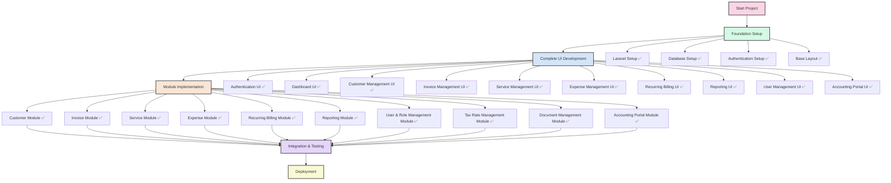
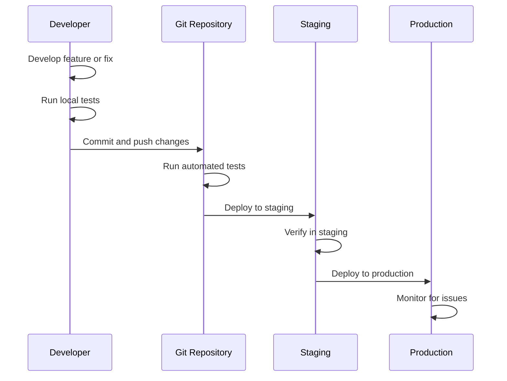
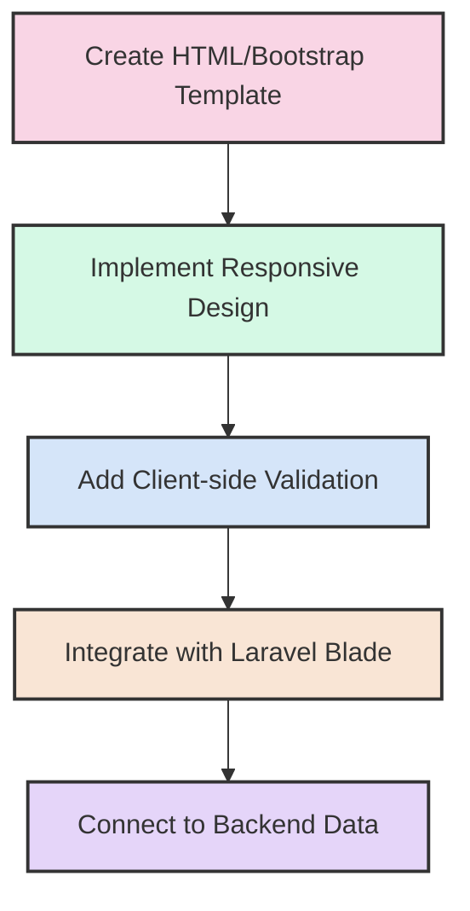
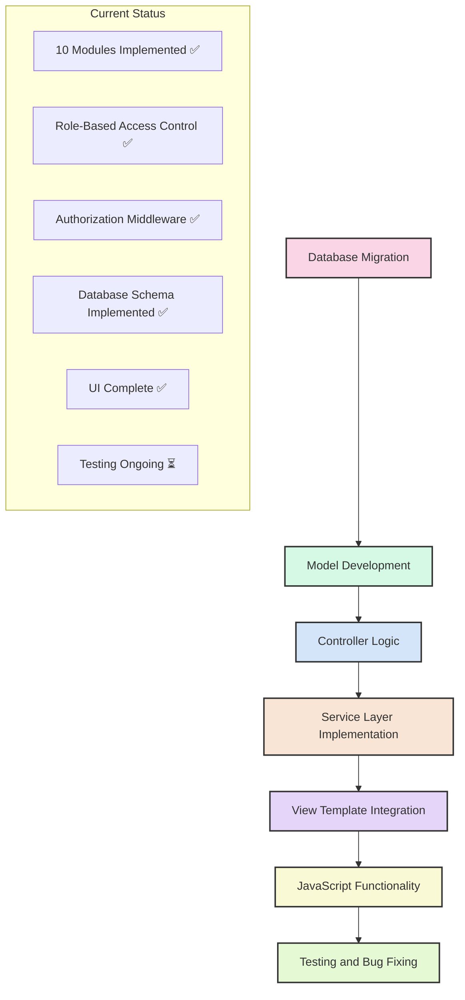
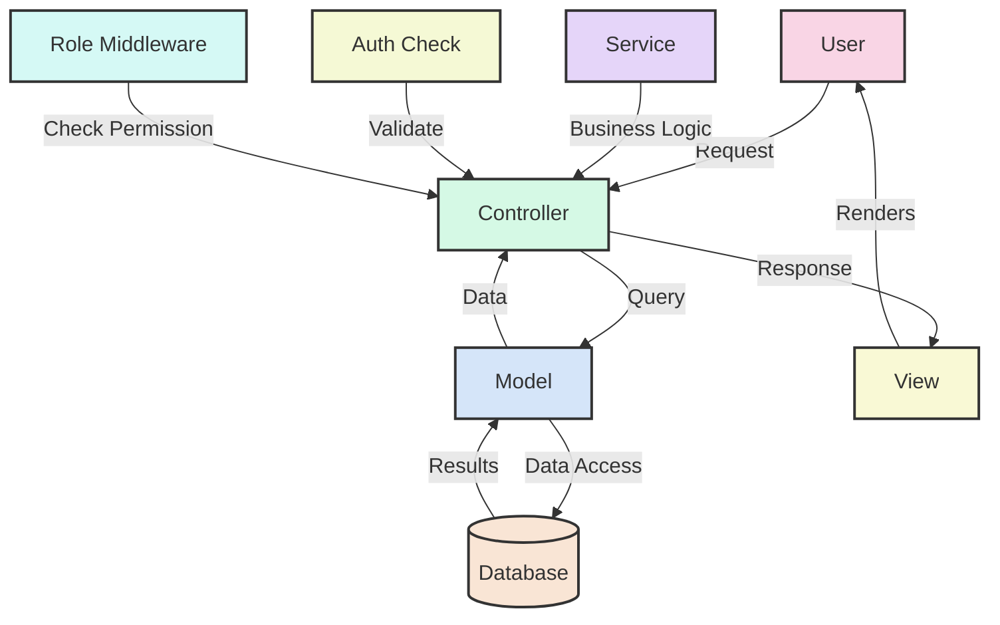

# Current Implementation Workflow & Status



## Development Process Flow



## UI Development Process



## Module Implementation Process



## Data Flow Diagram



## Role-Based Access Control

```mermaid
flowchart LR
    subgraph Roles
    Admin[Administrator]
    Manager[Manager]
    Sales[Sales Agent]
    Accountant[Accountant]
    Viewer[Viewer]
    end
    
    subgraph Features
    CM[Customer Management]
    IM[Invoice Management]
    SM[Service Management]
    EM[Expense Management]
    RM[Recurring Billing]
    RPT[Reporting]
    TM[Tax Management]
    DM[Document Management]
    AP[Accounting Portal]
    UM[User Management]
    end
    
    Admin -->|Full Access| CM & IM & SM & EM & RM & RPT & TM & DM & AP & UM
    Manager -->|Limited Access| CM & IM & SM & EM & RM & RPT
    Sales -->|Limited Access| CM & IM & SM
    Accountant -->|Limited Access| RPT & EM & AP
    Viewer -->|Read Only| CM & IM & SM & EM & RM & RPT
    
    style Admin fill:#f9d5e5,stroke:#333,stroke-width:2px
    style Manager fill:#d5f9e5,stroke:#333,stroke-width:2px
    style Sales fill:#d5e5f9,stroke:#333,stroke-width:2px
    style Accountant fill:#f9e5d5,stroke:#333,stroke-width:2px
    style Viewer fill:#e5d5f9,stroke:#333,stroke-width:2px
