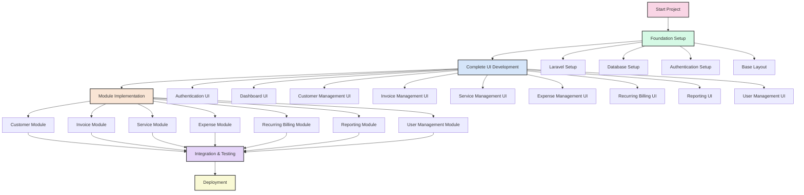
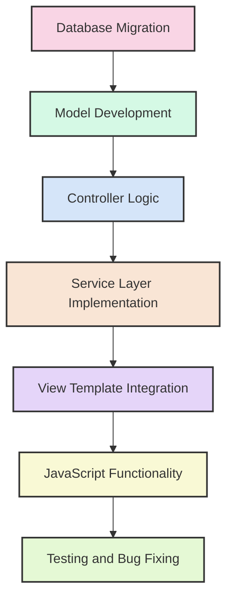

# Development Workflow Diagram



## Development Process Flow


## UI Development Process


## Module Implementation Process



## Data Flow Diagram

```mermaid
flowchart TD
    U[User] --> |Request| C[Controller]
    C --> |Query| M[Model]
    M --> |Data Access| DB[(Database)]
    DB --> |Results| M
    M --> |Data| C
    S[Service] --> |Business Logic| C
    C --> |Response| V[View]
    V --> |Renders| U
    
    style U fill:#f9d5e5,stroke:#333,stroke-width:2px
    style C fill:#d5f9e5,stroke:#333,stroke-width:2px
    style M fill:#d5e5f9,stroke:#333,stroke-width:2px
    style DB fill:#f9e5d5,stroke:#333,stroke-width:2px
    style S fill:#e5d5f9,stroke:#333,stroke-width:2px
    style V fill:#f9f9d5,stroke:#333,stroke-width:2px
